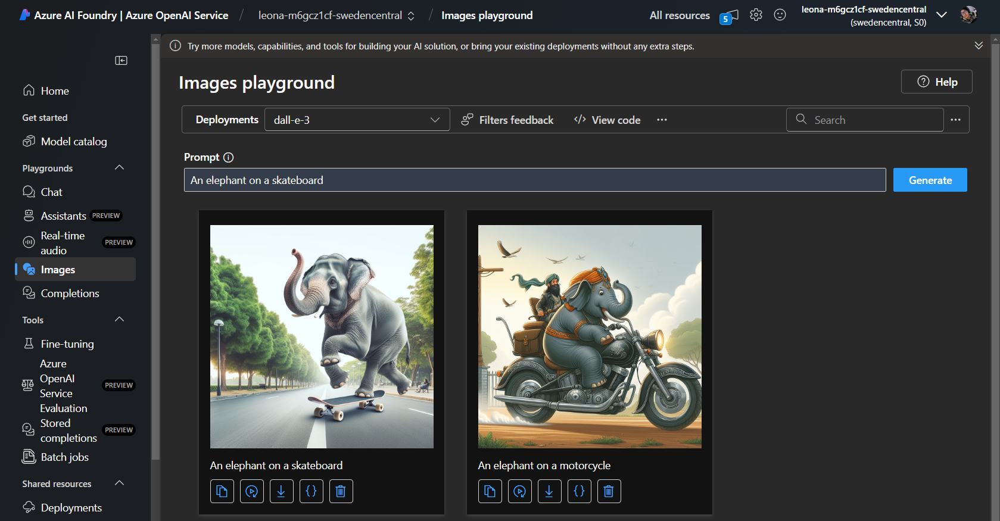

# Proyecto: Generación de Imágenes con DALL-E en Azure OpenAI Service

## Descripción
Este proyecto utiliza el modelo **DALL-E** disponible en el **Azure OpenAI Service** para generar imágenes a partir de descripciones en lenguaje natural. Usando un modelo de DALL-E versión 3, se puede generar una imagen original con solo proporcionar un prompt que describa lo que se desea visualizar.

El modelo de **DALL-E** permite a los usuarios generar imágenes únicas y detalladas basadas en simples descripciones textuales. Esto es útil en una amplia variedad de aplicaciones como la creación de contenido visual, diseño, marketing, arte digital y más.

## Objetivo
El objetivo principal de este proyecto es explorar cómo los desarrolladores y creativos pueden utilizar la inteligencia artificial para generar imágenes de alta calidad de manera rápida y eficiente mediante la interacción con el modelo DALL-E en Azure. El uso de este modelo facilita la creación de imágenes a partir de descripciones textuales sin la necesidad de habilidades avanzadas en diseño gráfico.

## Tecnologías Utilizadas
- **Azure OpenAI Service**: Para generar imágenes basadas en descripciones textuales utilizando el modelo DALL-E versión 3.
- **Python**: Lenguaje recomendado para interactuar con la API de OpenAI y gestionar los resultados de la generación de imágenes.

## Funcionamiento
El modelo DALL-E toma un **prompt en lenguaje natural** como entrada y genera una imagen que refleja la descripción proporcionada. Los usuarios pueden afinar sus descripciones para obtener resultados más específicos, permitiendo la creación de imágenes para distintos fines. Se pude usar desplegando el modelo directamente.



## Cómo Usar

### 1. Instalar Dependencias  
Para usar este proyecto, asegúrate de tener las dependencias necesarias instaladas. Si estás usando Python, puedes instalar las librerías requeridas ejecutando:

```bash
pip install -r requirements.txt
```

### 2. Configuración de Azure OpenAI
Asegúrate de tener una cuenta de Azure y una clave de API para acceder a los modelos de OpenAI. Configura tu entorno para que pueda comunicarse con la API de Azure.

### 3. Cargar credenciales
Crea un archivo `.env` en la raíz de tu proyecto y agrega las siguientes líneas con tus credenciales de Azure:

```bash
AZURE_OAI_KEY = ""
AZURE_OAI_ENDPOINT = ""
AZURE_OAI_DEPLOYMENT = ""
```

### 4. Ejecuta el programa
Ejecuta el script en Python para generar imágenes desde tus descripciones. A continuación, se muestra un ejemplo de cómo invocar la generación de imágenes:

```bash
python generate-image.py
```

### 5. Proporciona un prompt
Cuando se ejecute el programa, podrás ingresar un **prompt en lenguaje natural** describiendo la imagen que deseas generar. Por ejemplo:
```bash
A giraffe flying a kite
```
El programa te dará un enlace para acceder a tu imagen generada.

